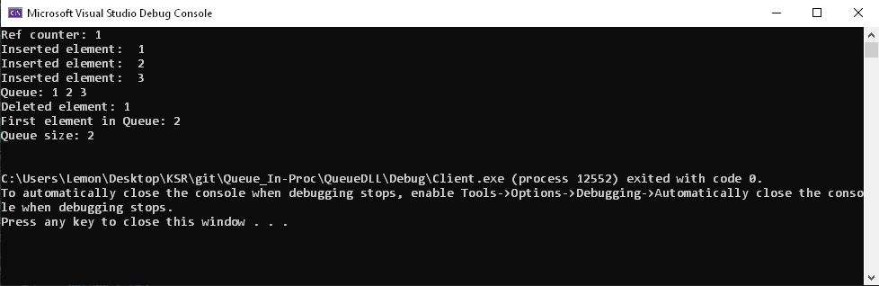

# COM-InProc-Queue
Implementing Queue Structure as Component Object Model (Inproc-Server) in C++

## Table of contents
* [General info](#general-info)
* [Work principle](#work-principle)
* [Setup](#setup)

## General info
This is an example of COM (Component Object Model) in C++. </br>
The Queue Structure is implemented as Inproces-Server. </br>
The client can use all implemented functions, knowing the only GUID of the Queue class object. </br>
As well Queue interface header file should be included. </br>

## Work principle
 </br>
1. CoCreateInstance call searches the registry for class registration information about the CLSID.
2. CoCreateInstance fetches the path to the DLL file with the class implementation.
3. CoCreateInstance loads the DLL and looks for the DllGetClassObject function in it and calls it.
4. DllGetClassObject creates a Factory object.
5. DllGetClassObject returns a pointer to the IClassFactory interface of the factory to CoCreateInstance
6. CoCreateInstance calls the CreateInstance method from the IClassFactory interface.
7. CoCreateInstance creates object - Queue.
8. CreateInstance takes a pointer to the IQueue interface from the Queue object and returns it to CoCreateInstance
9. CoCreateInstance returns the pointer to IQueue. The client uses the Queue object through the IQueue interface.

## Setup
To run this project you should: 
1. Open Visual Studio and create the Dynamic-Link Library project (You can choose - "Windows Desktop Wizard" and select dll type of project)</br>
 </br>

2. Add all files from github (QueueDLL\QueueDLL) to your project. </br>
Your structure should look like this: </br>
 </br>

3. Next step is to add definition file to the linker input </br>
(Right click on the project->properties->Linker->Input->Module Definition File)
 </br>

4. You should change all GUID's that I have in the project to yours. </br>
You can do it by generating them in visual studio and then past yours to the IQueue.h and GUID.cpp</br>
One GUID (CLSID) for the class (Queue) and another (IID) for the Interface (IQueue) </br>
 </br>

5. Then you should change GUIDS in registration file (register.reg and unregister.reg) </br>
And then register GUID's by clicking double click on the register.reg file. </br>
IMPORTANT! Be sure you have correct path to your .dll in registration file </br>
You can check in the cmd->regedit tool if you GUID was registered. </br>
 </br>

6. (Optional) You can set the ProgID in the same way as registration. </br>
This can help to find CLSID not by GUID number but with a special name (provider.component.version) </br>
If you do not do this step, uncomment CLSID_Queue in client IQueue.h file and comment these two lines of code </br> 
```
CLSID CLSID_Queue;
CLSIDFromProgID(L"COM.Queue.1", &CLSID_Queue);
```

7. Next, you should add new project to your Solution, this time it should be simple Console Application (the Client who will use your COM) </br>
Add all files from github (QueueDLL/Client) </br>
 </br>

8. Build solution and run the Client project (possible firstly you should right click to the Client project and choose - Set as StartUp Project </br>
 </br>

9. If the application is run successfully you will see the console like this:
 </br>

### Congratulation you build your In-Proc COM!
